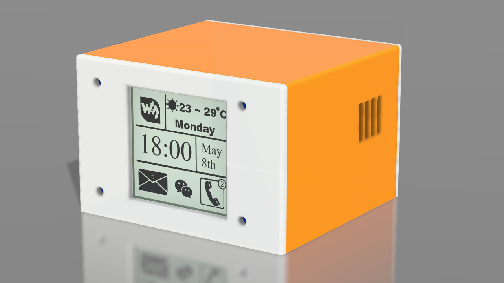
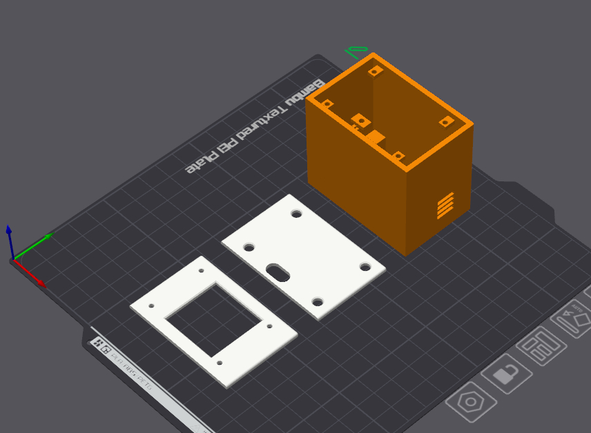
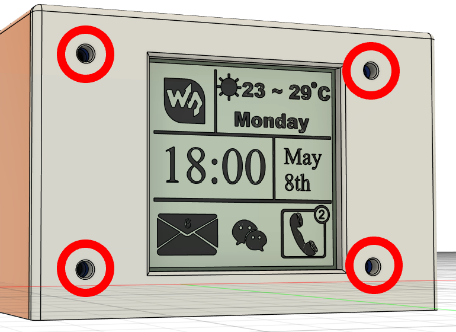
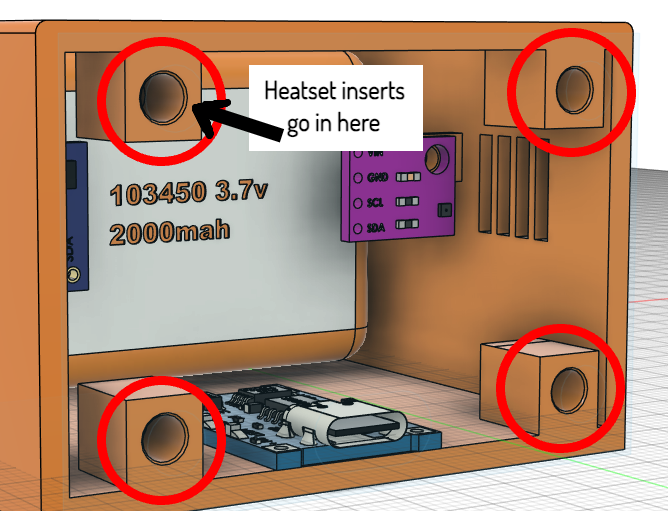
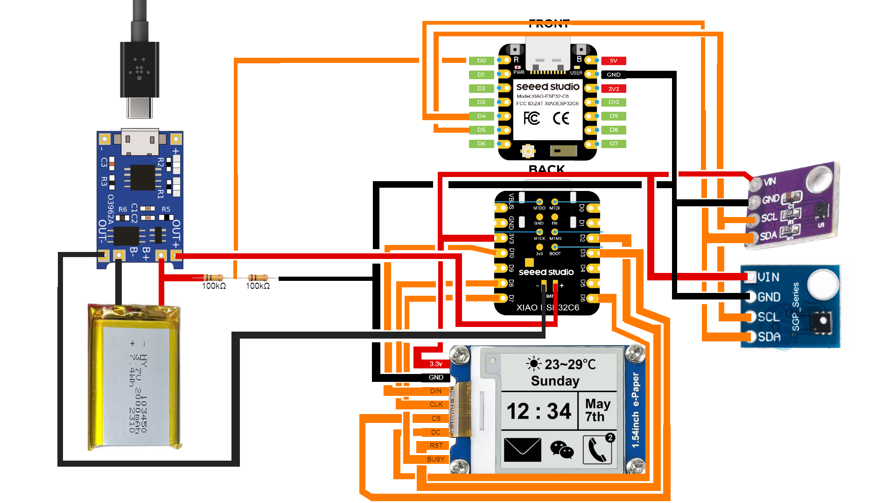

# AirLog-E
### A battery powered, E-Paper Home Assistant multi-sensor

This device is the called the AirLog-E (Beacuse it ***logs*** the ***air*** and has an ***E***-ink display)
## Features
- A **1.54" E-Ink/Paper display** to show current temperature, humidity, and the VOC Index
- It's got 2 sensors. The SHT41 for temp and humidity, and the SGP40 for the VOC Index.
- A large **2000mah Lipo** that can keep the device active and running for a few days on one charge! (can be increased based on deep sleep times)
- It's ability to go into **deep sleep**! At the moment, it wakes up every 90s, updates the sensors, sends it to HA then goes back to sleep after 30s. This can easily be changed to a 5min or even 10min sleep for battery life up to 3 weeks.
- Very **portable**! It's possible to take it with you, connect to your school/office/hotspot's wifi to keep the time updated. In the YAML code, i've predefined **2** networks but this can be expanded.
- If you ever want to change a parameter, you **don't** need to plug it into your computer. ESPhome fully supports OTA **(Over The Air) updates** and I've already written it into the code
- **Super accurate** sensors! The SGP-40 (the VOC sensor) utilises the temp and humidity readings from the SHT41 to get a more accurate VOC index.

## E-Ink? What's that??
E-ink or e-paper, is the technology being used in kindles, price tags etc. It only requires a small amount of current to update, and then uses **nothing** when static. You could even unplug the display and the image would stick. These are perfect for small battery powered projects. The only downside to them is their refresh rate. (can take up to **2s** to fully refresh)

## Hardware
(to see the full BOM (bill of materials) click [here](BOM/AirLog-BOMv2.csv))

All the components are enclosed in a 3D printed enclosure. It's split into 3 parts which should be (hopefully) **really easy to assemble and print.**   (all 3 parts can fit on a Bambu A1 Mini Build Plate, pictured below)

  

Theres the **front plate** which attaches to the main section via **M2.5 screws**. (pictured below) The M2.5 screws also hold the display in place.
  
#
The **back plate** is connected to the main section via **M3 screws** and **M3 heatset inserts** (pictured below)
#
  
#
The **main section** is where all of the electronics are housed. (see photo with battery, front plate, and display removed)
#

## Electronics
### Here's the breakdown:  

### **Microcontroller**
The microcontroller is the **SEEED Studio XIAO ESP32-C6** - it's a super compact microcontroller and perfect for smart home projects as it includes **WiFi, Bluetooth, Zigbee** etc. In the AirLog-E, it doesn't actually have a mounting postion as there are no screw holes and we need access to both sides of the board (for the BAT+ and BAT- pads). This means its **'freefloating'** inside the enclosure, but it would be pretty hard to move as theres 13 wires holding it down! It being freefloating also makes it easier to debug.

### **E-Ink Display**
The E-Ink display by Waveshare and is **1.54"** It's got a 200x200px screen and uses **SPI** to communincate. It can do a partial refresh in as little as **0.3s** and a full refresh in about 2s. Its also got 4 mounting holes in the corner which makes it a breeze to model an enclosure for.

### **2000mah Lipo Battery**
This battery is the perfect size at **10mm x 34mm x 50mm** and has a great capacity.

### **TP4056 Module**
The TP4056 module is **perfect** for this project as it can **charge super fast at 1A**. This means it can charge our battery from empty to full in **just over 2 hours**, and that's once a week!

### **SHT41 Module**
The SHT41 is an amazing little board that gives you **temperature and humidity readings** and communicates via an **I2C bus.**

### **SGP40 Module**
The SGP40 outputs a **VOC Index** which is a scale from **0 to 500** where 100 is a normal baseline and under 100 is cleaner air and over 100 is a **high concentration of VOCs.** It is used as a general air quality sensor. (Great for rooms with 3D printers)

### **M3 Heatset inserts**
Heatset inserts are great beacause it provides a **metal thread** for your screws to go into. I use **4** of these to **connect the back plate to the main section.**

### **26AWG Wire**
This wire is a **great size** as it isn't too big and fiddly to work with and solder but thick enough to carry voltages from the battery. I've chosen 3 colors - **Red, Black and Orange.** They are used for **Power, Ground and Data** respectively. You can use any color as its just for aesthetic purposes.

### **Resistors**
This **entire** project just needs **two** 100kΩ resistors for the voltage divider (which steps the battery voltage to a safe enough voltage that the ESP32's GPIO can read)

##

**Wiring Diagram** (created in Pixlr-E)

## What else?
There are some things I just **can't** implement into the YAML code before I get my hands on the parts.
These things include:
 - **The time** displayed on screen. This requires NTP (network time protocol) which I can't add yet.
 - **Making the display look futuristic** - At the moment, the sensors are displayed as dynamic text on the screen using the Dosis font. I'm unable to physically see what this looks like yet!

 **Rest assured, I will implement these features as soon as I get the parts!!**

 ## This project was made by William and is for the Hackclub Stardance Challenge!
 ### Credits also go to the ESPhome docs as I couldn't do it without them!

 **AI Usage Declaration**: I used AI as a teaching tool which, for example, explained specific ESPhome components if they weren't heavily documented, helping me fix fusion360 errors etc. I also used it to check if the YAML code will work when components arrive (it should work🤞) Every line of code, diagram, journal, and **this README** was written by me!
